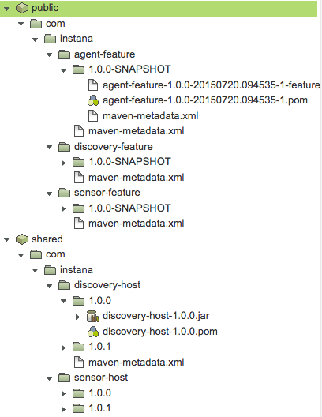

## Release procedure

The release procedure is simple, but there are a couple of constraints.
First of all, strict semantical versioning is required to have auto updates work.

The agent will by default pull updates from the repository once a day.
It can be triggered using `agent:update`.
The repository is defined in `etc/org.ops4j.pax.url.mvn.cfg`

`http://repo.public.instana.io/artifactory/features-internal@id=features@noreleases@snapshots@snapshotsUpdate=always`

The version of `agent-feature`, `discovery-feature` and `sensor-feature` is always
`1.0.0-SNAPSHOT`, this way the agent will always get the new definitions.

Customer releases should be pushed to `http://repo.public.instana.io/artifactory/features-public` and not contain any snapshot references anymore. At the moment it is expected to be a manual procedure.

To release a public version of the agent this line needs to be changed in maven config.

In the artifactory it should like

